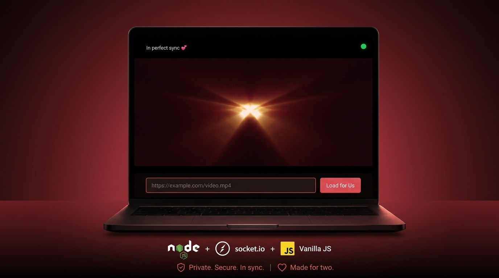

# Private Cinema ❤️

A minimalist, intimate synced video player for couples. Built with **Node.js + Socket.io** (backend) and **Vanilla JS** (frontend). Server-as-Master architecture for perfect sync.

<p align="center">
  
</p>

## Features
- Paste any direct video URL (mp4/webm)
- Real-time play/pause/seek sync
- Drift correction every 3s
- Heartbeat indicator (blue → green → yellow)
- **Secure shared password protection** (backend-verified socket authentication)
- Graceful late joiner support

## Password (Shared Secret)
To keep your room private, the cinema requires a password. The default fallback is **`date-night`**, but you should secure it using an environment variable on your backend server.

**To set your custom password:**
You do not need to edit any code! Simply create an environment variable named `CINEMA_SECRET` on your backend server (see Render instructions below).

## Deploy on Render (Recommended)

1. Fork / use this repo
2. Go to [Render Dashboard](https://dashboard.render.com) → **New Blueprint**
3. Connect `ryanraposo/private-cinema` (or your fork)
4. Render auto-detects `render.yaml` and deploys both your **server** and **frontend**.
5. **Configure Backend Secrets:**
   - Go to your newly deployed backend service in the Render dashboard.
   - Go to **Environment**.
   - Add a new variable: `CINEMA_SECRET` = your custom secret password.
6. **Configure Frontend Connection:**
   - Go to your frontend service in the Render dashboard.
   - Go to **Environment**.
   - Add a new variable: `SOCKET_URL` = your backend URL (e.g., `https://private-cinema-server.onrender.com`).
7. **Redeploy both services** to apply the environment variables.

## Local Development

```bash
# Backend
npm install
# Optional: Set your custom secret for local testing
export CINEMA_SECRET="my-local-secret" 
npm start

# Frontend
Open index.html in browser
